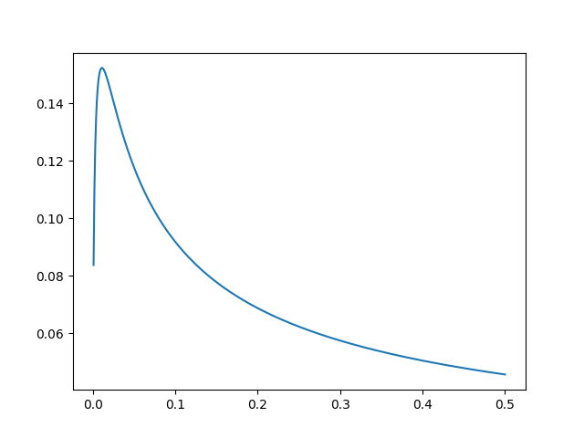

# localization

Este script es usado para calcular la función de localización de un estado de dispersión. La teoría detrás del método se encuentra en el [siguiente paper](https://www.sciencedirect.com/science/article/pii/S0370269304001753). Este método es útil para determinar que región del continuo es mas significativa para determinar el espacio modelo.

Este programa funciona con un programa en fortran que coloquialmente denominamos [CWF](https://www.sciencedirect.com/science/article/abs/pii/001046559400135O). El script modifica los inputs, ordena correr el programa y luego procesa los outputs.

## Comented Version of the code 

```python
import numpy as np
import subprocess as sp
from scipy import integrate as scp
from scipy import interpolate as interp
import matplotlib.pyplot as plt
```

Las librerias, funciones y módulos a importar serán:

`numpy` se importa para los arrays y otras funciones

`subprocess` es necesario para poder correr `cwf`

`scipy.integrate` lo uso para hacer la integral de `wf.dat`

`scipy.interpolate` se usa para interpolar la función de onda

`matplotlib.pyplot` realiza la gráfica de la función

```python
def IntegFromData(xvalues,yvalues,sup):
    if (sup > np.max(xvalues)):
        return print("Extremo superior no válido, intente con otro valor.")
    else:
        function = interp.CubicSpline(xvalues,yvalues)
        result = scp.quadrature(function, np.min(xvalues), sup, tol=0.000001 )
        # result is a tuple (integral_value,error)
        return result[0]
```

Función para realizar una integración numérica de un set de datos. Para éste código en particular va a ser usada para integrar la función de onda. Primero se realiza una interpolacion con splines cúbicos y luego se utiliza cuadratura gaussiana como método de integración. Observar que la función posee tres parámetros de entrada, la grilla en $x$, la grilla en $y$ y el extremo superior de integración. El extremo de integración se pide que no sea superior al máximo valor en $x$  de la grilla.

Se usa la cuadratura gaussiana por su precisión. Sin embargo, ésta no puede ser usada con grillas de datos, por lo que se arma una “función” con los datos interpolados. 

La función devuelve el resultado de la integral, un número real

```python
sp_input = ["1", "0", "1", "0.0", "-0.0"]

energies = []
localization = []

extr = 1.2
```

Los datos del input se ponen en una lista, que luego será pasada a string y guardada en un archivo. Las variables `energies` y `localization` almacenarán la energía y su correspondiente resultado de la integral 

`extr` es el coeficiente del extremo de integración, a definirse según interés del cálculo. Debe ser un número real.

```python
for item in np.arange(0.001,0.501,0.001):
    sp_input[3] = str(item)

    with open("Read/sp.dat","w") as data:
        data.write(" \t".join(sp_input))

    # Correr el código
    sp.run(["./cwf"])

    wf = np.loadtxt('Out/wf.dat', usecols = (0,1))
    R_N = np.loadtxt('Out/bigr.dat', max_rows = 1)

    energies.append(item)
    localization.append( IntegFromData( wf[:,0], wf[:,1]**2, extr*R_N ) )
```

Loop central, el iterable recorre los valores de energía de interés. 

Primero se guarda en la lista el valor de la energía y luego se escribe el archivo input de `cwf`. 

Luego se corre `cwf`. Dentro de los output que nos interesa tenemos la funcion de onda y el radio del núcleo (importante para la integración)

Cargamos en variables a la funcion de onda y el radio del nucleo.

Guardamos en las variables energies y localization el valor de la energía en cuestión y el resultado de la integral. Observar que el extremo de integración es el radio multiplicado por el coeficiente definido mas arriba.

```python
with open("local.dat","w") as local:
    for f, b in zip(energies, localization):
        local.write(" {0:.3f} \t {1:5f} \n".format(f, b))
```

Guardamos en un archivo los valores calculados

```python
plt.xlabel("Energy [MeV]")
plt.ylabel("L(E)")

plt.legend()
plt.plot(energies,localization,"-")

plt.savefig("localization.pdf",format="pdf")
plt.show()
```

Graficamos la curva. El siguiente gráfico es un ejemplo del resultado
